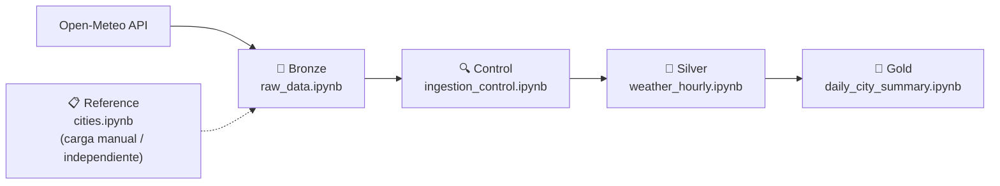

# 🌤️ Databricks Weather Mexico

Pipeline de datos en **PySpark / Databricks** que ingesta, transforma y modela información meteorológica de las 32 capitales estatales de México, aplicando la **arquitectura Medallón (Bronze → Silver → Gold)**.

Proyecto desarrollado como parte de mi portafolio de ingeniería de datos, para demostrar el uso de **Python, PySpark, SQL, Delta Lake y Databricks** en un flujo end-to-end de ingesta, validación y transformación de datos.

---

## 📌 Descripción general

El proyecto consume la API pública de **[Open-Meteo](https://open-meteo.com/)** para obtener el pronóstico horario (temperatura, humedad relativa y precipitación) de la capital de cada uno de los 32 estados de México, y lo procesa a través de tres capas:

- **Bronze**: datos crudos (raw JSON) tal como los devuelve la API.
- **Silver**: datos limpios, tipados y desanidados a nivel de registro por hora.
- **Gold**: datos agregados y listos para consumo analítico (resumen diario por ciudad).

Entre bronze y silver corre un paso de **control de calidad de la ingesta**, que valida cuántas de las 24 horas esperadas por estado realmente llegaron.

Un **job de Databricks** ejecuta el pipeline principal todos los días a las **00:05**, orquestando en secuencia los notebooks de ingesta, control y transformación.



---

## 🗂️ Estructura del proyecto

```
databricks_weather_mexico/
├── README.md
└── script/
    ├── 01_bronze/
    │   └── raw_data.ipynb            # Ingesta desde la API de Open-Meteo
    ├── control/
    │   └── ingestion_control.ipynb   # Valida completitud de la ingesta (horas esperadas vs. recibidas)
    ├── 02_silver/
    │   └── weather_hourly.ipynb      # Desanida el JSON crudo a nivel hora
    ├── 03_gold/
    │   └── daily_city_summary.ipynb  # Agregación diaria por ciudad
    ├── reference/
    │   └── cities.ipynb              # Carga el catálogo de ciudades/estados
    └── utils/
        └── config.py                 # Catálogo estático de las 32 capitales (lat/lon)
```

La estructura separa explícitamente:
- **Capas de la arquitectura medallón** (`01_bronze`, `02_silver`, `03_gold`): transforman datos de negocio de un nivel de calidad al siguiente.
- **`control/`**: metadata operativa del pipeline (no es un dato de negocio, es un chequeo sobre la ingesta).
- **`reference/`**: catálogo/dimensión estático que no depende de una fuente externa cruda y no corre en el job diario.

---

## 🔄 Flujo de datos y tablas

| Carpeta | Notebook | Tabla Delta | Descripción | Modo de escritura |
|---|---|---|---|---|
| `reference/` | `cities.ipynb` | `weather.cities` | Catálogo de las 32 capitales con `state_code`, lat/lon | `overwrite` inicial / `MERGE` (clave: `state` + `city`) |
| `01_bronze/` | `raw_data.ipynb` | `weather.raw_data` | Payload JSON crudo por ciudad y fecha de ingesta, con reintentos | `overwrite` inicial / `MERGE` (clave: `state_code` + fecha de ingesta) |
| `control/` | `ingestion_control.ipynb` | `weather.ingestion_control` | Compara las 24 horas esperadas contra las horas efectivamente ingeridas por estado y día, con un `success_flag` | `overwrite` inicial / `MERGE` (clave: `state_code` + `expected_timestamp`) |
| `02_silver/` | `weather_hourly.ipynb` | `weather.weather_hourly` | Registros horarios de temperatura, humedad y precipitación, desanidados del JSON crudo | `overwrite` inicial / `MERGE` (clave: `state_code` + fecha y hora de medición) |
| `03_gold/` | `daily_city_summary.ipynb` | `weather.daily_city_summary` | Promedio/máx/mín de temperatura, humedad promedio y precipitación total por día y ciudad | `overwrite` inicial / `MERGE` (clave: `state_code` + fecha) |

### Job diario (00:05)
El job orquesta, en orden, los siguientes notebooks:

1. `01_bronze/raw_data.ipynb`
2. `control/ingestion_control.ipynb`
3. `02_silver/weather_hourly.ipynb`
4. `03_gold/daily_city_summary.ipynb`

> `reference/cities.ipynb` (catálogo de ciudades) se ejecuta de forma independiente/manual, ya que es una carga de referencia que no cambia diariamente.

---

## 🛠️ Stack técnico

- **Databricks** (notebooks, jobs/orquestación, Delta Lake)
- **PySpark** (`DataFrame API`, `Window functions`, `from_json`/`explode`/`arrays_zip` para desanidar JSON)
- **Spark SQL**
- **Delta Lake** (`MERGE`/upsert como estrategia de escritura en las tres capas)
- **Python** (`requests` para consumo de API REST, manejo de reintentos)
- **API pública**: [Open-Meteo Forecast API](https://open-meteo.com/en/docs)

### Aspectos técnicos destacados

- **Ingesta resiliente**: `raw_data.ipynb` reintenta hasta 3 veces la llamada a la API si la respuesta no trae las 24 horas esperadas, antes de continuar con un payload parcial marcado como `PARTIAL_SUCCESS`.
- **Control de calidad post-ingesta**: `ingestion_control.ipynb` reconstruye, por estado y hora, cuáles de las 24 horas esperadas realmente se recibieron, generando un `success_flag` auditable en `weather.ingestion_control` antes de que el dato avance a silver.
- **Upsert incremental en las tres capas**: uso de `DeltaTable.merge()` con clave compuesta en cada tabla, para acumular histórico día a día sin duplicar registros en reejecuciones del job.
- **Desanidado de JSON semi-estructurado**: `weather_hourly.ipynb` usa `from_json` + `arrays_zip` + `explode` para convertir el arreglo horario de la API en registros individuales por hora.
- **Agregaciones Gold**: métricas diarias (promedio, máximo, mínimo, suma) calculadas con la API de agregación de Spark.

---

## 🚀 Cómo ejecutarlo

1. Importar el proyecto a un workspace de Databricks (Repos o carga manual de notebooks).
2. Ejecutar `reference/cities.ipynb` una vez, para generar el catálogo de ciudades (`weather.cities`).
3. Configurar un job en Databricks que ejecute en secuencia:
   - `01_bronze/raw_data.ipynb`
   - `control/ingestion_control.ipynb`
   - `02_silver/weather_hourly.ipynb`
   - `03_gold/daily_city_summary.ipynb`
4. Programar el job con un trigger diario (por ejemplo, `00:05`).